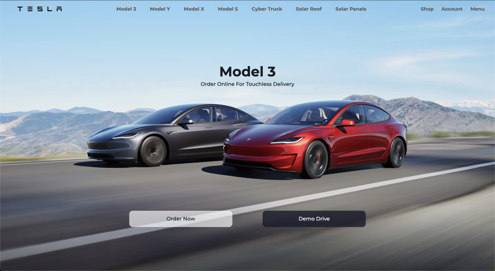
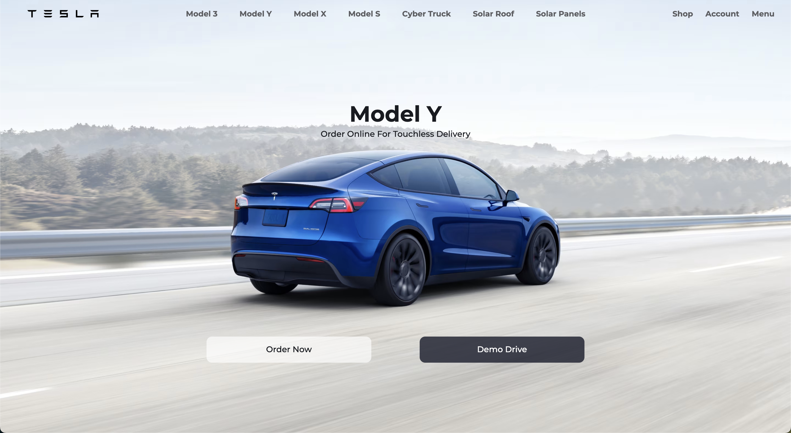
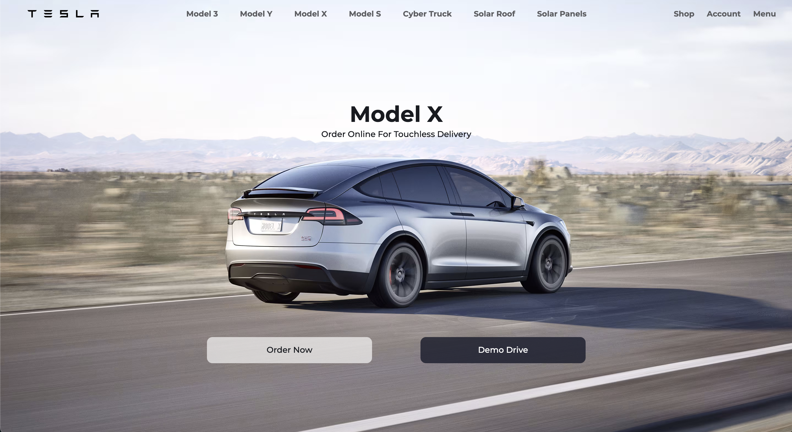
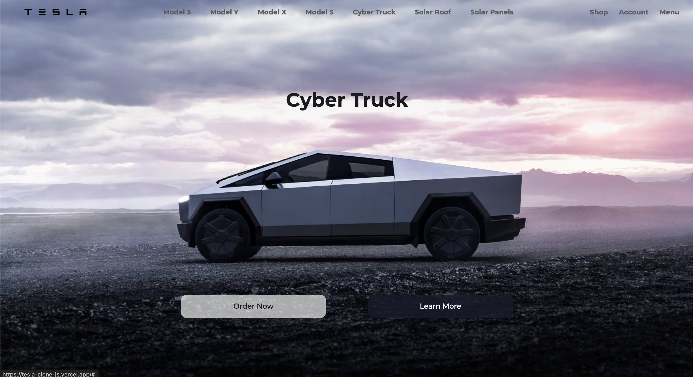

<h1>Tesla Website Clone</h1>

<h2>About the project</h2>

  
This is a clone project of Tesla website homepage. The clone will replicate the look and feel of the Tesla website's homepage, including its layout, design elements, and some interactivity.

👉 Live Demo: <a href='https://tesla-clone-js.vercel.app/'>Live Demo</a>

<h3>Build with:</h3>

» HTML5, CSS3, JavaScript

### Screenshot

